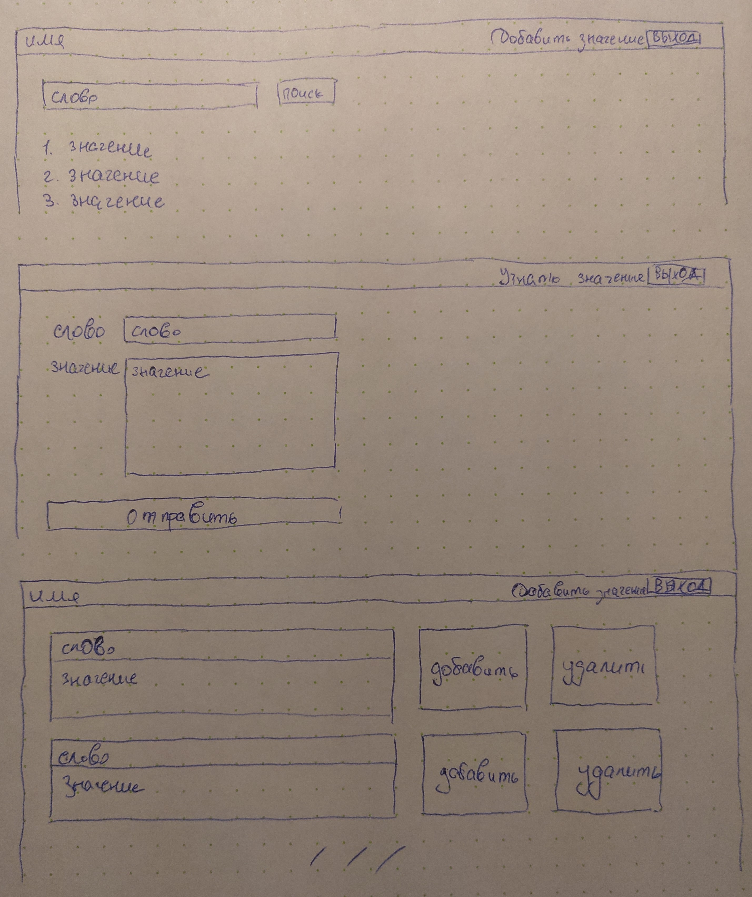
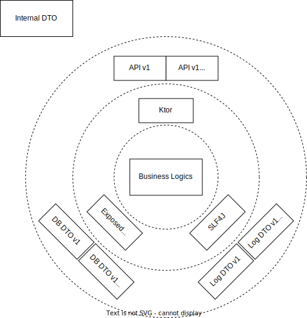

# О проекте "Современный словарь русского языка"

Проект представляет собой словарный сервис, в котором словам русского языка соответствуют их значения.

Пользователи имеют возможность узнавать значения интересующих их слов, а также участвовать в пополнении словаря
новыми словами и/или значениями.

Администратор сервиса имеет возможность отсматривать поступающие дополнения и принимать решение
о включении их в состав словаря либо удалении.

# Целевая аудитория

Считаем, что целевая аудитория словарного сервиса - лица среднего школьного возраста и старше, желающие:
1. узнать значение незнакомого им слова;
2. дополнить сервис вновь появляющимися в языке
   либо просто отсутствующими по какой-либо причине словами и значениями.

### Гипотетические портреты пользователей, желающих узнать значение незнакомого им слова

Можно выделить несколько сегментов пользователей
1. Студенты учебных заведений
    1. Лица от 10 до 25 лет
    2. С начальным, основным или средним общим, неоконченным средним профессиональным,
       неоконченным высшим профессиональным образованием
    3. Осваивают учебную программу по литературе и другим предметам
2. Трудоспособные граждане
    1. Лица от 18 до 65 лет
    2. С оконченным средним профессиональным или высшим профессиональным образованием
    3. Имеют квалифицированную работу
    4. Повышают свою квалификацию и/или увлекаются литературой
3. Пенсионеры
    1. Лица от 60 лет
    2. С оконченным средним профессиональным или высшим профессиональным образованием
    3. На заслуженном отдыхе
    4. Изучают последние научно-технические достижения и/или увлекаются литературой

### Гипотетические портреты пользователей, желающих дополнить сервис словами и значениями

Можно выделить несколько сегментов пользователей
1. Прогрессивные слои населения
    1. Лица от 10 до 65 лет
    2. С начальным, основным или средним общим, средним профессиональным,
       высшим профессиональным образованием
    3. Интересуются новыми изобретениями или культурными явлениями
2. Консервативные слои населения
    1. Лица от 50 лет
    2. С оконченным средним профессиональным или высшим профессиональным образованием
    3. Обладают широким кругозором в классических областях знаний

### Гипотетический портрет администраторов

1. Лица от 25 до 65 лет
2. С оконченным средним профессиональным или высшим профессиональным образованием
3. Обладают широким кругозором как в классических, так и в передовых областях знаний
4. Обладают навыками проверки достоверности фактов и утверждений

# Пользовательские истории

### Получение подтвержденных значений слова

**В качестве** пользователя сервиса \
**Я хочу** видеть список подтвержденных значений для моего слова \
**Для того, чтобы** правильно понять контекст, содержащий это слово

Сценарий: \
**Дано:** у меня есть слово, значение которого я хочу узнать. \
**Когда** я ввожу слово в форму и нажимаю кнопку поиска, \
**тогда** я вижу список подтвержденных значений этого слова, \
**и** список значений по умолчанию отсортирован в порядке добавления.

### Добавление значений слова

**В качестве** пользователя сервиса \
**Я хочу** добавлять значения для моего слова \
**Для того, чтобы** другие пользователи правильно понимали контекст, содержащий это слово

Сценарий: \
**Дано:** у меня есть слово, значение которого я хочу добавить. \
**Когда** я ввожу слово и значение в форму и нажимаю кнопку отправки формы, \
**тогда** я вижу сообщение о том, что значение отправлено на рассмотрение администраторам.

### Получение неподтвержденных значений всех слов

**В качестве** администратора сервиса \
**Я хочу** видеть список неподтвержденных значений для всех слов \
**Для того, чтобы** управлять этими записями

Сценарий: \
**Дано:** у меня есть аккаунт администратора. \
**Когда** я открываю раздел неподтвержденных значений, \
**тогда** я вижу список неподтвержденных значений всех слов, \
**и** список значений по умолчанию отсортирован в порядке добавления, \
**и** длина списка значений по умолчанию не более 5.

### Перемещение неподтвержденного значения в подтвержденные

**В качестве** администратора сервиса \
**Я хочу** переводить неподтвержденные значения в подтвержденные \
**Для того, чтобы** обычный пользователь мог видеть их в списке подтвержденных значений

Сценарий: \
**Дано:** у меня есть аккаунт администратора и заданное значение заданного слова. \
**Когда** я открываю раздел неподтвержденных значений \
и нажимаю кнопку подтверждения у этого значения, \
**тогда** выбранное значение становится подтвержденным.

### Удаление неподтвержденного значения

**В качестве** администратора сервиса \
**Я хочу** удалять неподтвержденные значения из сервиса \
**Для того, чтобы** не засорять список неподтвержденных значений отклоненными из них

Сценарий: \
**Дано:** у меня есть аккаунт администратора и заданное значение заданного слова. \
**Когда** я открываю раздел неподтвержденных значений \
и нажимаю кнопку отклонения у этого значения, \
**тогда** выбранное значение удаляется из сервиса.

# Макеты

# Архитектура приложения

# API

### Функции (эндпоинты)

1. POST /api/v1//meaning/create
2. POST /api/v1//meaning/read
3. POST /api/v1//meaning/update
4. POST /api/v1//meaning/delete
5. POST /api/v1//meaning/search

### Описание сущности meaning

1. id: идентификатор
2. word: строка со словом
3. meaning: строка со значением
4. proposedBy: имя пользователя, который предложил значение
5. approved: флаг подтверждения значение (true/false)